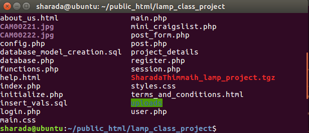
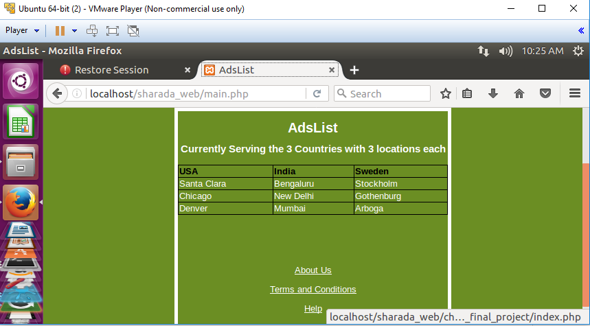

<h1>AdsList</h1>
AdsList is like a Mini Craiglist project. This uses LAMP stack. It has user authentication. Input validation is done 
using RegEx. Uses Object Oriented PHP. It's developed on Ubuntu linux platform.

<h2>Use Case </h2>
 For the use case, goto the link, https://sharadalt.github.io/portfolio/plamplist
 
<h2>Configuration</h2>

    

 

<h2>How to run it </h2>

To start the application you run it like any other rails application with the command, first start the apache server:

$ sudo ./lampp start

Starting XAMPP for Linux 7.0.13-1...

XAMPP: Starting Apache...ok.

XAMPP: Starting MySQL...ok.

XAMPP: Starting ProFTPD...ok.

sharada@ubuntu:/opt/lampp$ 

Goto the browser and start with main.php, localhost/sharada_web/main.php

    

 
 
